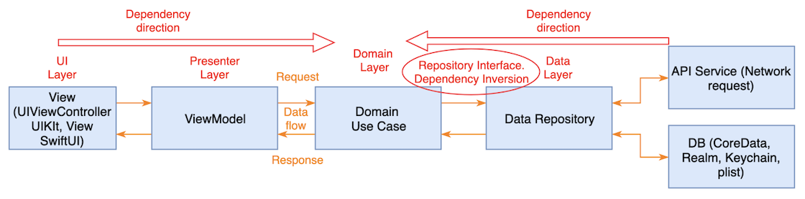
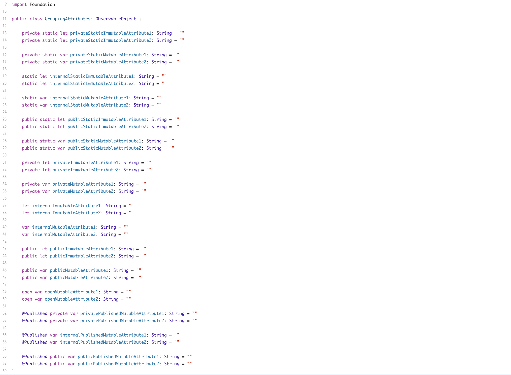

GodTools
========

- [Requirements](#requirements)
- [Architecture](#architecture)
- [Architecture Responsibilities](#architecture-responsibilities)
- [Fastlane](#fastlane)

### Requirements

- Xcode
- Bundler
- Cocoapods
- Fastlane

### Architecture

The GodTools app architecture consists of 3 layers (Presentation Layer, Domain Layer, and Data Layer), along with a Coordinator Pattern (Navigation decisions and logic).

#### Clean Architecture Pattern:
- Presentation Layer: (View and ViewModel)
- Domain Layer: (Use Cases, Domain Models, and Data Layer Interfaces)
- Data Layer: (Implements domain layer interfaces and consists of Repositories, Networking, Peristence, and other Data Connectivity)
- Data-DomainInterface: (In GodTools we have this additional layer which holds all the business logic.  These classes will implement the domain interfaces and operate on the raw data layer classes and apply business rules)

#### Purpose of this Architecture:
- Creates a clear separation of concerns and responsibilities.
- Each layer will have its own responsibilities and the components that make up a layer will have their own responsibilities.
- Enables changes to have isolated impact and allows for the system to be easily extended and maintained.
- Enables us to build a system in the same way that follows best practices without the need for micromanagement.

### Architecture Responsibilities

#### Presentation Layer

- Makes up the visual aspect of the app as well as user interaction (button tap, text input, etc.) 
- Uses the View / ViewModel pattern.
- Knows nothing of the data layer.  Only knows about the Domain Layer.

##### View Responsibilities
- Rendering logic (SwiftUI).
- Animation logic (SwiftUI).
- References a ViewModel using property wrapper @ObservedObject.
- Observes ViewModel output via @Published properties.
- Sends inputs to the ViewModel (button tap, text input, page viewed, etc.).

##### ViewModel Responsibilities
- Considered a View representation. However, knows nothing of the specific UI elements that structure a View. 
- Defines the inputs, these are typically user initiated inputs.  The view makes calls to these inputs in order to drive the data.
- Communicates to the Domain Layer via UseCases which are injected upon initialization.  
- Provides output to the View via @Published properties to update View state by implementing Combine's ObservableObject protocol.

#### Domain Layer

- Makes up the business aspect of the app  by utilizing Use Cases, Domain Models, and Data Layer Interfaces.
- Use Cases define user related actions in the app.  Implementing Use Cases gives us a high level description of how the app behaves (Screaming Architecture).
- Domain Models will encapsulate business related attributes visually seen and used in the app.
- Interfaces define how UseCases interact with the DataLayer.  The purpose of the interface is to accomplish the dependency inversion principle. 

##### UseCase  Responsibilities
- Defines a business scenario in most cases on behalf of a specific user.  Naming should reflect some type of user action in the app.  This aids in Screaming Architecture.  An example in GodTools could be a user viewing a particular screen, or a user searching for an app language in the app languages list, or a user authenticating.
- Splits the responsibilities of the ViewModel into readable UseCases which reduces ViewModel complexity and also provides better app behaviour readability (Screaming Architecture).
- Should be responsible for a single task and named to reflect that task.
- Operates on the data layer utilizing dependency inversion.  This means UseCases should only point to interfaces. 
- Should define inputs needed to produce the output of the UseCase.  UseCases should typically produce a DomainModel output that encapsulates the business requirements.
- Once a UseCase is defined, it is then composed of 1 or more interfaces (dependency inversion principle) to complete the Use Case DomainModel.
- By using dependency inversion, concrete implementations can isolate the business rules keeping the data layer free from such responsibilities. 

##### Use Cases (Best Practices)

- Should have a single exposed method (public, internal) that takes zero or more inputs and produces a single output that is an AnyPublisher. 
- UseCases can have private methods, however, as we move to dependency inversion I think private methods will become less and less.
- Inputs should not be publisher types. Instead the ViewModel should react to changes which then triggers the UseCase.
- Should not reference or depend on other UseCases.  This particular situation would occur if a UseCase needed the result of the referenced UseCase.  Instead, the result should be injected when envoking the UseCase from the ViewModel.
- Should depend only on interfaces. Most of the time we depend on some type of Repository Interface where a Repository is simply a data storage and data access.
- Would prefer that UseCases return a non Swift type and instead some type of DomainModel that encapsulates attributes related to the business requirements.

##### Interfaces
- All use cases will be composed of 1 or more interfaces to accomplish dependency inversion.  In most situations these interfaces will be some type of repository interface for fetching data or an interface to perform some sort of service on the data layer.
- Interfaces should also define any clear inputs to accomplish the intent and produce a Combine Publisher output.  In most situations the Combine Publisher should produce a Domain Model.  

##### Domain Models
- These will model app specific data or business specific data.  This is typically data users will visually see and interact with.

#### Data-DomainInterface
- Classes that implement the domain interfaces to achieve dependency inversion.  These classes operate on the raw data layer classes and these classes contain all the business formatting, logic, and rules.

#### Data Layer

- Responsible for data retrieval, data storage, and other data connectivity such as sending analytics, communicating to remote databases, web sockets, etc.
- Typical data storage can include a remote database, disk cache (CoreData, Realm, UserDefaults, NSFileManager), app bundle (.json, .txt, .png, .jpg, etc.), and even hardcoded data in a swift file.
- Should know nothing of the Presentation Layer and knows of the Domain Layer via UseCase Interfaces.

##### Repositories

A large number of our classes in the DataLayer will be suffixed by Repository.  Think of a Repository as a simple container for storing data and accessing data.  How that data is stored and accessed is up to the Repository.

A Repository has the following responsibilities:

- Very simple in concept.  Provides data storage and data retrieval.
- Encapsulates data storage types (remote, disk, bundle, hardcoded).
- Should produce a single type suffixed by DataModel that underlying data (persistence, networking) maps to.

#### Coordinator
The coordinator is a pattern used for navigation decisions, navigation logic, and dependency injection.  In GodTools, any class that implements the Flow protocol is a class that implements the coordinator pattern.

- Makes decisions when it comes to navigation.  Actions are sent to the coordinator and it's up to the coordinator to decide where to navigate next based on the action.  The GodTools actions are defined in the FlowStep enum.
- Once navigation is determined, the coordinator will instantiate the view, viewModel, inject any dependencies, and then perform navigation. 

#### Additional Resources:
- Solid principles: 
    - https://www.geeksforgeeks.org/solid-principle-in-programming-understand-with-real-life-examples/
- Coordinator (Flow.swift): 
    - https://khanlou.com/2015/01/the-coordinator/
    - https://twittemb.github.io/posts/2017-11-08-RxFlow-Part1/
    - https://twittemb.github.io/posts/2017-12-09-RxFlow-Part2/

#### Fastlane

Below are some helpful references to GitHub Actions Workflows and Fastlane Files that the GodTools project uses.

- Project Fastlane Fastfile (https://github.com/CruGlobal/godtools-swift/blob/develop/fastlane/Fastfile) points to shared Fastfile (https://github.com/CruGlobal/cru-fastlane-files/blob/master/Fastfile)

- Uses a combination of Fastlane Environment Variables(https://github.com/CruGlobal/godtools-swift/blob/develop/fastlane/.env.default) and GitHub Secrets

- GitHub Actions Build Workflow: https://github.com/CruGlobal/godtools-swift/blob/develop/.github/workflows/build.yml

- GitHub Actions OneSky Workflow: https://github.com/CruGlobal/godtools-swift/blob/develop/.github/workflows/download_onesky_translations.yml

- GitHub Actions OneSky Workflow Dependency Plugin: https://github.com/thekie/fastlane-plugin-onesky

#### Conventions

- [Classes](#classes)
- [Project Folder Structure](#project-folder-structure)

##### Classes

- Class / Struct attributes should always be declared with the type.
- It is also preferred that there is a consistent grouping of Class / Struct attributes.  This way the code we produce has a similar form which can help when quickly reading someone else's code.  Below is a screenshot of the preferred grouping of Class / Struct attributes.  These attributes are broken into 3 high level groupings, static attributes, instance attributes, and special attributes (property wrappers, etc.)  Within those 3 high level groupings, attributes are grouped by access level private, internal, public, and open.  Within the access level grouping, attributes are then grouped by immutable first, then mutable.  
  

#### Project Folder Structure

There are 3 primary folders to be aware about in the project folder structure.  Those are the Features, Flows, and Share folders.

##### Features Folder

The features folder should consist of sub folders named according to a feature in the app.  As new features are added into the app, new feature folders should be created.  

The idea of a feature folder is to isolate code specific to that feature.  Think of it as it's own module.  The primary goal for this is scalability. As the app continues to grow and new features are added, we can keep a flat hierarchy of features and their dependencies.

Within a feature folder are 5 folders.  Data, Data-DomainInterface, DependencyContainer, Domain, Presentation.

###### App/Feature/Data Folder

This folder will contain the data layer specific code needed for the feature. 

###### App/Feature/Data-DomainInterface Folder

This folder will contain the domain interface implementation code needed for the feature. 

###### App/Feature/DependencyContainer Folder

This folder will contain the dependency container, data layer container, and domain layer container classes for creating the dependencies (dependency injection) needed for the feature.

###### App/Feature/Domain Folder

This folder will contain the domain layer specific code needed for the feature and will contain subfolders UseCases, Entities (possibly changing to DomainModels), and Interfaces. 

###### App/Feature/Presentation Folder

This folder will contain the presentation layer specific code needed for the feature.

###### App/Flows Folder

This folder will contain specific navigation flows in the app to achieve the coordinator pattern.

###### App/Share Folder

This folder contains code that is shared across features.  One area to highlight is the /Share/Data-DomainInterface/Supporting/ folder which contains more granular business formatting and rules that can be shared across domain interface implementations.
