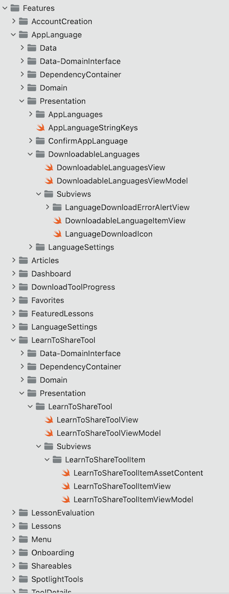

GodTools
========

- [Requirements](#requirements)
- [Architecture](#architecture)
- [Architecture Responsibilities](#architecture-responsibilities)
- [Fastlane](#fastlane)

### Requirements

- Xcode
- Bundler
- Cocoapods
- Fastlane

### Architecture

The GodTools app architecture consists of 3 layers (Presentation Layer, Domain Layer, and Data Layer), along with a Coordinator Pattern (Navigation decisions and logic).

#### Clean Architecture Pattern:
- Presentation Layer: (View and ViewModel)
- Domain Layer (Use Cases, Domain Models, and Data Layer Interfaces)
- Data Layer (Implements domain layer interfaces and consists of Repositories, Networking, Peristence, and other Data Connectivity)

#### Purpose of this Architecture:
- Creates a clear separation of concerns and responsibilities.
- Each layer will have its own responsibilities and the components that make up a layer will have their own responsibilities.
- Enables changes to have isolated impact and allows for the system to be easily extended and maintained.
- Enables us to build a system in the same way that follows best practices without the need for micromanagement.

### Architecture Responsibilities

#### Presentation Layer

- Makes up the visual aspect of the app as well as user interaction (button tap, text input, etc.) 
- Uses the View / ViewModel pattern.
- Knows nothing of the data layer.  Only knows about the Domain Layer.

##### View
- Rendering logic (SwiftUI).
- Animation logic (SwiftUI).
- References a ViewModel using property wrapper @ObservedObject.
- Observes ViewModel output via @Published properties.
- Sends inputs to the ViewModel (button tap, text input, page viewed, etc.).

##### ViewModel
- Considered a View representation. However, knows nothing of the specific UI elements that structure a View. 
- Accepts inputs from the View (button tap, text input, page viewed, etc.).
- Communicates to the Domain Layer via UseCases which are injected upon initialization.  
- Provides output to the View via @Published properties to update View state by implementing Combine's ObservableObject protocol.

#### Domain Layer

- Makes up the business aspect of the app  by utilizing Use Cases, Domain Models, and Data Layer Interfaces.
- Use Cases define user related actions in the app.  Implementing Use Cases gives us a high level description of how the app behaves (Screaming Architecture).
- Domain Models will encapsulate business related attributes visually seen and used in the app.
- Interfaces define how UseCases interact with the DataLayer.  The purpose of the interface is to accomplish the dependency inversion principle. 

##### Use Cases
- Defines a business scenario in most cases on behalf of a specific user.  Naming should reflect some type of user action in the app.  This aids in Screaming Architecture.  An example in GodTools could be a user viewing a particular screen, or a user searching for an app language in the app languages list, or a user authenticating.
- Splits the responsibilities of the ViewModel into readable UseCases which reduces ViewModel complexity and also provides better app behaviour readability (Screaming Architecture).
- Should be responsible for a single task and named to reflect that task.
- Operates on the data layer utilizing dependency inversion.  This means UseCases should only point to interfaces. 
- Should define inputs needed to produce the output of the UseCase.  UseCases should typically produce a DomainModel output that encapsulates the business requirements.
- Once a Use Case is defined, it is then composed of 1 or more interfaces (dependency inversion principle) to complete the Use Case DomainModel.
- By using dependency inversion, concrete implementations can isolate the business rules keeping the data layer free from such responsibilities. 

##### Use Cases (Best Practices)

- Should have a single exposed method (public, internal) that takes zero or more inputs and produces a single output that is an AnyPublisher. 
- UseCases can have private methods, however, as we move to dependency inversion I think private methods will become less and less.
- Inputs should not be publisher types. Instead the ViewModel should react to changes which then triggers the UseCase.
- Should not depend on UseCases. If specific Output from a UseCase is needed, instead inject that Output as an Input from the ViewModel.
- Should depend only on interfaces. Most of the time we depend on some type of Repository Interface where a Repository is simply a data storage and data access.
- Would prefer that UseCases return a non Swift type and instead some type of DomainModel that encapsulates attributes related to the business requirements.

##### Interfaces
- All use cases will be composed of 1 or more interfaces to accomplish dependency inversion.  In most situations these interfaces will be some type of repository interface for fetching data or an interface to perform some sort of service on the data layer.
- Interfaces should also define any clear inputs to accomplish the intent and produce a Combine Publisher output.  In most situations the Combine Publisher should produce a Domain Model.  

##### Domain Models
- These will model app specific data or business specific data.  This is typically data users will visually see and interact with.

#### Data Layer

- Responsible for data retrieval, data storage, and other data connectivity such as sending analytics, communicating to remote databases, web sockets, etc.
- Typical data storage can include a remote database, disk cache (CoreData, Realm, UserDefaults, NSFileManager), app bundle (.json, .txt, .png, .jpg, etc.), and even hardcoded data in a swift file.
- Should know nothing of the Presentation Layer and knows of the Domain Layer via Use Case Interfaces.

##### Repositories

A large number of our classes in the DataLayer will be suffixed by Repository.  Think of a Repository as a simple container for storing data and accessing data.  How that data is stored and accessed is up to the Repository.

A Repository has the following responsibilities:

- Very simple in concept.  Provides data storage and data retrieval.
- Encapsulates data storage types (remote, disk, bundle, hardcoded).
- Should produce a single type suffixed by DataModel that underlying data (persistence, networking) maps to.

#### Coordinator
The coordinator is a pattern used for navigation decisions, navigation logic, and dependency injection.  In GodTools, any class that implements the Flow protocol is a class that implements the coordinator pattern.

- Makes decisions when it comes to navigation.  Actions are sent to the coordinator and it's up to the coordinator to decide where to navigate next based on the action.  The GodTools actions are defined in the FlowStep enum.
- Once navigation is determined, the coordinator will instantiate the view, viewModel, inject any dependencies, and then perform navigation. 

#### Additional Resources:
- Solid principles: 
    - https://www.geeksforgeeks.org/solid-principle-in-programming-understand-with-real-life-examples/
- Coordinator (Flow.swift): 
    - https://khanlou.com/2015/01/the-coordinator/
    - https://twittemb.github.io/posts/2017-11-08-RxFlow-Part1/
    - https://twittemb.github.io/posts/2017-12-09-RxFlow-Part2/

#### Fastlane

Below are some helpful references to GitHub Actions Workflows and Fastlane Files that the GodTools project uses.

- Project Fastlane Fastfile (https://github.com/CruGlobal/godtools-swift/blob/develop/fastlane/Fastfile) points to shared Fastfile (https://github.com/CruGlobal/cru-fastlane-files/blob/master/Fastfile)

- Uses a combination of Fastlane Environment Variables(https://github.com/CruGlobal/godtools-swift/blob/develop/fastlane/.env.default) and GitHub Secrets

- GitHub Actions Build Workflow: https://github.com/CruGlobal/godtools-swift/blob/develop/.github/workflows/build.yml

- GitHub Actions OneSky Workflow: https://github.com/CruGlobal/godtools-swift/blob/develop/.github/workflows/download_onesky_translations.yml

- GitHub Actions OneSky Workflow Dependency Plugin: https://github.com/thekie/fastlane-plugin-onesky

// TODO: Complete here on down.

#### Conventions

- [Classes](#classes)
- [Project Folder Structure](#project-folder-structure)

#### Classes

- Class / Struct attributes should always be declared with the type.
- Class level attributes should also be grouped by constant vs instance as well as by access level and mutability. Where constants are at the top and grouped by private first, then internal, then public.  Instance variables follow constants and are grouped by private first, then internal, then public.   

#### Project Folder Structure

##### Presentation Layer

The presentation layer makes up the Views and ViewModels.  In the GodTools app Views and ViewModels are organized by Feature in the Features folder.  Below will explain how presentation files are named and organized and conventions for Views and ViewModels.

- [File Naming and Organization](#file-naming-and-organization)
- [Views](#views)
- [ViewModels](#viewmodels)

###### Features Folder

The presentation layer will make up Views and ViewModels and those are stored in the App/Features folder.  The Features folder attempts to group presentation files by feature type. 

For example the GodTools App/Features/ folder currently contains the following features:

###### Feature Folder

Each Feature Folder is broken into views that make up that feature.  Typically each view that makes up a feature represents an entire screen area of the app and are navigated between.  Each of these views that make up a feature should be placed in a directory that matches the name of the view.  These would fall under Features/{FeatureName}/Presentation/.

For example in this screenshot the following features LanguageSettings and ToolDetails are expanded.  The views that make up the LanguageSettings feature are ChooseLanguage and LanguageSettings.  The views that make up the ToolDetails feature are ToolDetails.

Any smaller view components that help in creating the parent view should go in a Subviews directory. 

For example in this screenshot the ToolDetails view folder contains a Subviews folder containing all the subviews that help make up ToolDetailsView.swift.

##### Views

File Naming and Organization:
- All newly created views should be created in SwiftUI.
- Views should have only 1 ViewModel.
- Subviews that are static and help make up a screen (View) can point to the parent screen (View) ViewModel or they can have their own ViewModel.
- Subviews that are dynamic such as views in collections (lists, stacks, etc.) should have there own ViewModel and only 1 ViewModel.

##### UseCases

File Naming and Organization:
- Use cases are typically stored by feature under Features/Domain/UseCases/ folder.  Use cases should be specific to the business use case for a feature. 

In this screenshot the ToolDetails feature Use cases are expanded.  These are all of the Use cases that make up that feature.  Each Use case is in a directory that matches the Use case name and contains a domain model with DomainModel suffix.

