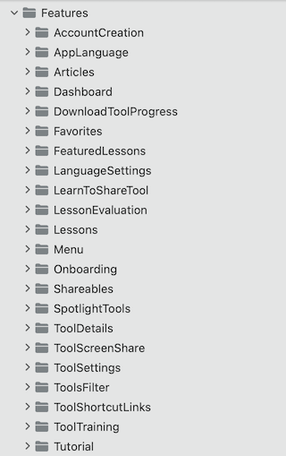

GodTools
========

- [Requirements](#requirements)
- [Programming Guide](#programming-guide)

### Requirements

- Xcode
- Bundler
- Cocoapods
- Fastlane

### Programming Guide

- [Conventions](#conventions)
- [Architecture](#architecture)
- [Fastlane](#fastlane)

#### Conventions

- [Classes](#classes)

#### Classes

- Class / Struct attributes should always be declared with the type.
- Class level attributes should also be grouped by constant vs instance as well as by access level and mutability. Where constants are at the top and grouped by private first, then internal, then public.  Instance variables follow constants and are grouped by private first, then internal, then public.   

#### Architecture

- [Summary](#summary)
- [Presentation Layer](#presentation-layer)
- [Domain Layer](#domain-layer)
- [Data Layer](#data-layer)
- [Coordinator](#coordinator)

#### Summary
The architectural structure for the GodTools app can be summarized as following a Clean Architecture Pattern (Presentation Layer, Domain Layer, and Data Layer), along with a Coordinator Pattern (Navigation decisions and logic), and SOLID principles.

The purpose of this pattern is to create a clear separation of concerns and responsibilities.  Implementing strict coding standards means code can be easily read, modified, and tested.

Clean Architecture at its core is about creating a separation of concerns and building it in such a way that it becomes hard to violate this core principle.  This approach enables us to build a system in the same way that follows best practices without the need for micromanagement. 

Having Clean Architecture enables changes to have isolated impact and allows for the system to be easily extended and maintained.

References:
- Solid principles: 
    - https://www.geeksforgeeks.org/solid-principle-in-programming-understand-with-real-life-examples/
- Coordinator (Flow.swift): 
    - https://khanlou.com/2015/01/the-coordinator/
    - https://twittemb.github.io/posts/2017-11-08-RxFlow-Part1/
    - https://twittemb.github.io/posts/2017-12-09-RxFlow-Part2/

#### Presentation Layer

The presentation layer makes up the Views and ViewModels.  In the GodTools app Views and ViewModels are organized by Feature in the Features folder.  Below will explain how presentation files are named and organized and conventions for Views and ViewModels.

- [File Naming and Organization](#file-naming-and-organization)
- [Views](#views)
- [ViewModels](#viewmodels)

##### File Naming and Organization

###### Features Folder

The presentation layer will make up Views and ViewModels and those are stored in the App/Features folder.  The Features folder attempts to group presentation files by feature type. 

For example the GodTools App/Features/ folder currently contains the following features:

###### Feature Folder

Each Feature Folder is broken into views that make up that feature.  Typically each view that makes up a feature represents an entire screen area of the app and are navigated between.  Each of these views that make up a feature should be placed in a directory that matches the name of the view.  These would fall under Features/{FeatureName}/Presentation/.

For example in this screenshot the following features LanguageSettings and ToolDetails are expanded.  The views that make up the LanguageSettings feature are ChooseLanguage and LanguageSettings.  The views that make up the ToolDetails feature are ToolDetails.

Any smaller view components that help in creating the parent view should go in a Subviews directory. 

For example in this screenshot the ToolDetails view folder contains a Subviews folder containing all the subviews that help make up ToolDetailsView.swift.

##### Views

Views are what a user visually sees and interacts with.

###### View Responsibilities:
- Render logic.
- Animation logic.
- Owns a ViewModel (reference to ViewModel).
- Observes ViewModel output.  In SwiftUI this is a combination of @ObservedObject and @Published properties.
- Send inputs to the ViewModel (button tap, entering text input, etc.).

File Naming and Organization:
- All newly created views should be created in SwiftUI.
- Views should have only 1 ViewModel.
- Subviews that are static and help make up a screen (View) can point to the parent screen (View) ViewModel or they can have their own ViewModel.
- Subviews that are dynamic such as views in collections (lists, stacks, etc.) should have there own ViewModel and only 1 ViewModel.

##### ViewModels

ViewModels are considered a view representation.  They're the data backing of a view.

###### ViewModel Responsibilities:
- Provides data outputs to the View which the View can observe and react to.
- Each data output connects to a UseCase (Domain Layer) which computes data.  Computing can also happen directly in the ViewModel although UseCases are preferred.

#### Domain Layer With Dependency Inversion

The domain layer is responsible for the business rules of the application.  The benefits of the domain layer include:
- It splits responsibilities of the ViewModel into readable UseCases which reduces ViewModel complexity and also provides better readability (Screaming Architecture).
- It improves testability.  UseCases can be easily mocked (by using dependency inversion) to write behavior tests.
- It isolates the business rules and logic keeping the data layer clean from such responsibilities. 

In GodTools our Domain Layer will be broken into 3 categories (UseCases, Interfaces, and Entities).

##### - Use Cases

UseCases are the meat of the domain layer and give us insight to how the app behaves from a user stand point.  UseCases describe some type of user action such as AuthenticateUserUseCase, ViewSpotlightToolsUseCase, CreateToolScreenShareSessionUseCase.

Responsibilities:

- Naming should reflect some type of user action in the app.  This aids in Screaming Architecture.
- Should be responsible for a single task and named to reflect that task.
- Operates on the data layer utilizing dependency inversion.  This means UseCases should only point to interfaces.  This makes UseCases easy to mock when writing behavior tests.
- Typically will provide a single method that takes in 0 or more inputs and produces a single output (domain model).

File Naming and Organization:
- Use cases are typically stored by feature under Features/Domain/UseCases/ folder.  Use cases should be specific to the business use case for a feature. 

In this screenshot the ToolDetails feature Use cases are expanded.  These are all of the Use cases that make up that feature.  Each Use case is in a directory that matches the Use case name and contains a domain model with DomainModel suffix.

#### Data Layer

The data layer is responsible for data retrieval, data storage, and other data connectivity such as sending analytics, communicating to remote databases, web sockets, etc.

Typical data storage can include a remote database, disk cache (CoreData, Realm, UserDefaults, NSFileManager), app bundle (.json, .txt, .png, .jpg, etc.), and even hardcoded data in a swift file.

##### - Repositories

Repositories are a pattern that GodTools is shifting towards in the data layer and is responsible for encapsulating data storage types.  Think of a repository as a container for storing data.  How that data is stored is up to the repository.  

A Repository has the following responsibilities:

- Provides data retrieving and data storage.
- Encapsulates data storage types (remote, disk, bundle, hardcoded).

#### Coordinator

The Coorindator is responsible for the navigation decisions, dependency injection, and the navigation between views. In GodTools, any class that implements the Flow protocol is a class that implements the coordinator pattern. 
The Coordinator is the decision maker when it comes to navigation. For example, say a user taps a button to login, the coordinater (Flow) receives this as a step enumeration (describes an action) and determines where to navigate based on that action. Once navigation is determined, the coordinator will instantiate the view, viewModel, inject any dependencies, and then perform navigation.

#### Fastlane

Below are some helpful references to GitHub Actions Workflows and Fastlane Files that the GodTools project uses.

- Project Fastlane Fastfile (https://github.com/CruGlobal/godtools-swift/blob/develop/fastlane/Fastfile) points to shared Fastfile (https://github.com/CruGlobal/cru-fastlane-files/blob/master/Fastfile)

- Uses a combination of Fastlane Environment Variables(https://github.com/CruGlobal/godtools-swift/blob/develop/fastlane/.env.default) and GitHub Secrets

- GitHub Actions Build Workflow: https://github.com/CruGlobal/godtools-swift/blob/develop/.github/workflows/build.yml

- GitHub Actions OneSky Workflow: https://github.com/CruGlobal/godtools-swift/blob/develop/.github/workflows/download_onesky_translations.yml

- GitHub Actions OneSky Workflow Dependency Plugin: https://github.com/thekie/fastlane-plugin-onesky
