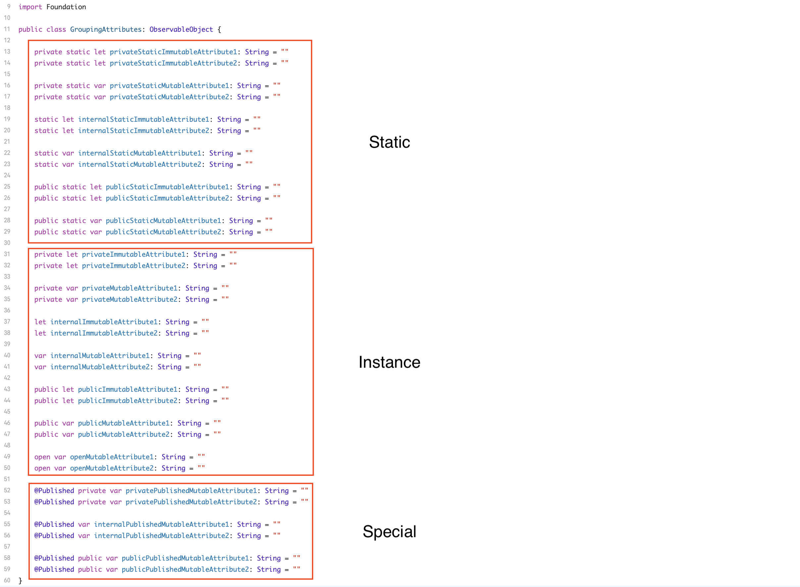

[](https://codecov.io/gh/CruGlobal/godtools-swift)

GodTools
========

- [Requirements](#requirements)
- [Architecture](#architecture)
- [Architecture Responsibilities](#architecture-responsibilities)
- [Localization](#localization)
- [godtoolsTests Target](#godtoolstests-target)
- [Fastlane](#fastlane)
- [Build Errors and Pod Install Troubleshooting](#build-errors-and-pod-install-troubleshooting)

### Requirements

- Xcode
- Bundler
- Cocoapods
- Fastlane
- Java 21SDK For Kotlin GodToolsToolParser (https://www.oracle.com/java/technologies/downloads/#java21)

### Architecture


The GodTools app architecture consists of 3 layers (Presentation Layer, Domain Layer, and Data Layer), along with a Coordinator Pattern (Navigation decisions and logic).

#### Clean Architecture Pattern:
- Presentation Layer: (View and ViewModel)
- Domain Layer: (Use Cases, Domain Models, and Data Layer Interfaces)
- Data Layer: (Implements domain layer interfaces and consists of Repositories, Networking, Peristence, and other Data Connectivity)
- Data-DomainInterface: (In GodTools we have this additional layer which holds all the business logic.  These classes will implement the domain layer interfaces and operate on the raw data layer classes and apply business rules)

#### Purpose of this Architecture:
- Creates a clear separation of concerns and responsibilities.
- Each layer will have its own responsibilities and the components that make up a layer will have their own responsibilities.
- Enables changes to have isolated impact and allows for the system to be easily extended and maintained.
- Enables us to build a system in the same way that follows best practices without the need for micromanagement.

### Architecture Responsibilities

#### Presentation Layer

- Makes up the visual aspect of the app as well as user interaction (button tap, text input, etc.) 
- Uses the View / ViewModel pattern.
- Knows nothing of the data layer.  Only knows about the Domain Layer.

##### View Responsibilities
- Rendering logic (SwiftUI).
- Animation logic (SwiftUI).
- References a ViewModel using property wrapper @ObservedObject.
- Observes ViewModel output via @Published properties.
- Sends inputs to the ViewModel (button tap, text input, page viewed, etc.).  Purpose here is to drive data.

##### ViewModel Responsibilities
- Considered a View representation or data backing of the View. However, knows nothing of the specific UI elements that structure a View. 
- Defines the inputs, these are typically user initiated inputs.  The view makes calls to these inputs in order to drive the data.
- Communicates to the Domain Layer via UseCases which are injected upon initialization.  
- Provides output to the View via @Published properties to update View state by implementing Combine's ObservableObject protocol.

#### Domain Layer

- Makes up the business aspect of the app  by utilizing Use Cases, Domain Models, and Data Layer Interfaces.
- Use Cases define user related actions in the app.  Implementing Use Cases gives us a high level description of how the app behaves (Screaming Architecture).
- Domain Models will encapsulate business related attributes visually seen and used in the app.
- Interfaces define how UseCases interact with the DataLayer.  The purpose of the interface is to accomplish the dependency inversion principle. 

##### UseCase  Responsibilities
- Defines a business scenario in most cases on behalf of a specific user.  Naming should reflect some type of user action in the app.  This aids in Screaming Architecture.  An example in GodTools could be a user viewing a particular screen, or a user searching for an app language in the app languages list, or a user authenticating.
- Splits the responsibilities of the ViewModel into readable UseCases which reduces ViewModel complexity and also provides better app behaviour readability (Screaming Architecture).
- Should be responsible for a single task and named to reflect that task.
- Operates on the data layer utilizing dependency inversion.  This means UseCases should only point to interfaces. 
- Should define inputs needed to produce the output of the UseCase.  UseCases should typically produce a DomainModel output that encapsulates the business requirements.
- Once a UseCase is defined, it is then composed of 1 or more interfaces (dependency inversion principle) to complete the UseCase DomainModel.
- By using dependency inversion, concrete implementations can isolate the business rules keeping the data layer free from such responsibilities. 

##### Use Cases (Best Practices)

- Should have a single exposed method (public, internal) that takes zero or more inputs and produces a single output that is an AnyPublisher. 
- UseCases can have private methods, however, as we move to dependency inversion I think private methods will become less and less.
- Inputs should not be publisher types. Instead the ViewModel should react to changes which then triggers the UseCase.
- Should not reference or depend on other UseCases.  Should only depend on interfaces.  There may be situations where a UseCase_A requires some data from the result of UseCase_B in order to complete UseCase_A.  In these situations UseCase_A should have already defined the inputs it needs to complete UseCase_A and the ViewModel should reference both UseCase_A and UseCase_B and inject data from UseCase_B into UseCase_A.
- Should depend only on interfaces. Most of the time we depend on some type of Repository Interface where a Repository is simply a data storage and data access.
- Would prefer that UseCases return a non Swift type and instead some type of DomainModel that encapsulates attributes related to the business requirements.

##### Interfaces
- All use cases will be composed of 1 or more interfaces to accomplish dependency inversion.  In most situations these interfaces will be some type of repository interface for fetching data or an interface to perform some sort of service on the data layer.
- Interfaces should define any clear inputs to accomplish the intent and produce a single AnyPublisher output.  In most situations the AnyPublisher should produce a DomainModel.  

##### Domain Models
- These will model app specific data or business specific data.  This is typically data users will visually see and interact with.

#### Data-DomainInterface
- Consists of classes that implement the domain layer interfaces to achieve dependency inversion.  These classes operate on the raw data layer classes and these classes contain all the business formatting, logic, and rules.  The purpose is to isolate the business rules keeping the data layer free from such responsibilities.

#### Data Layer

- Responsible for data retrieval, data storage, and other data connectivity such as sending analytics, communicating to remote databases, web sockets, etc.
- Typical data storage can include a remote database, disk cache (CoreData, Realm, UserDefaults, NSFileManager), app bundle (.json, .txt, .png, .jpg, etc.), and even hardcoded data in a swift file.
- Should know nothing of the Presentation Layer and only knows of the Domain Layer via Domain Layer Interfaces.

##### Repositories

A large number of our classes in the DataLayer will be suffixed by Repository.  Think of a Repository as a simple container for storing data and accessing data.  How that data is stored and accessed is up to the Repository.

A Repository has the following responsibilities:

- Very simple in concept.  Provides data storage and data retrieval.
- Encapsulates data storage types (remote, disk, bundle, hardcoded).
- Should produce a single type suffixed by DataModel that underlying data (persistence, networking) maps to.

#### Coordinator
The coordinator is a pattern used for navigation decisions, navigation logic, and dependency injection.  In GodTools, any class that implements the Flow protocol is a class that implements the coordinator pattern.

- Makes decisions when it comes to navigation.  Actions are sent to the coordinator and it's up to the coordinator to decide where to navigate next based on the action.  The GodTools actions are defined in the FlowStep enum (https://github.com/CruGlobal/godtools-swift/blob/master/godtools/App/Flows/Flow/FlowStep.swift).
- Once navigation is determined, the coordinator will instantiate the view, viewModel, inject any dependencies, and then perform navigation. 

##### Coordinator (Best Practices)

- Navigation actions (steps) shouldn't describe where to navigate to next. It's up to the coordinator to respond to an action and decide where to navigate to next.
- Flows can have child flows where a child flow will delegate to the parent flow that it has completed.  This is useful in cleaning up memory and responding to completed flows.
- A child flow can share a UINavigationController stack with the parent flow.  This keeps navigation on the same stack.
- A child flow can also have its own UINavigationController stack, for instance when presented modally.
- In almost all cases the ViewModel will point to a FlowDelegate? reference and delegate actions defined in the FlowStep enum (https://github.com/CruGlobal/godtools-swift/blob/master/godtools/App/Flows/Flow/FlowStep.swift).
- Because UIKit is used for navigation, UIBarButtonItems should also be configured in the Flow when creating the View (UIViewController).

```swift
// Create a class that implements Flow

class MyFlow: Flow {

    // NOTE: If this flow is a child of a parent flow it can delegate up to the parent flow. Useful in cleaning up memory and telling the parent that the flow has completed.
    private weak var flowDelegate: FlowDelegate?
    
    let appDiContainer: AppDiContainer
    let navigationController: AppNavigationController

    init(flowDelegate: FlowDelegate, appDiContainer: AppDiContainer, sharedNavigationController: AppNavigationController {
        
        self.flowDelegate = flowDelegate
        self.appDiContainer = appDiContainer
        // NOTE: This example is sharing the navigation stack with the parent flow.
        self.navigationController = sharedNavigationController
    }

    func navigate(step: FlowStep) {
        
        switch step {

        default:
            break
        }
    }
}
```

#### Additional Resources:
- Solid principles: 
    - https://www.geeksforgeeks.org/solid-principle-in-programming-understand-with-real-life-examples/
- Coordinator (Flow.swift): 
    - https://khanlou.com/2015/01/the-coordinator/
    - https://twittemb.github.io/posts/2017-11-08-RxFlow-Part1/
    - https://twittemb.github.io/posts/2017-12-09-RxFlow-Part2/

### Localization

The GodTools app is localized for many languages which are translated in OneSky.  When adding new strings for localization, all one needs to do is update the Base Localizable.strings.  Newly added strings will be placed into OneSky and translations will be ordered.  The GitHub Action workflow Download And Commit OneSky Translations will run daily to create a pull request for any Localizable.strings files that have been updated in OneSky.

### godtoolsTests Target
##### Behavior Tests
Behavior tests (a by product of Behavior-Driven Development) are tests that verify how the app should behave from a user perspective.  In GodTools, these tests are typically implemented against the domain interface implementation where the business logic lives and validate that the implementation gives us the expected business results. These tests can also get more elaborate by testing multipe components together to ensure the outcome gives the expected behavior. 

Each behavior test should start with the Given, When, Then acceptance criteria.

Given: Describes the initial state or context of the system before the behavior testing begins. It will set the stage by defining preconditions.
When: Describes the action that will trigger the behavior to be tested. Most of the time this action will contain inputs that drive the behavior being tested. 
Then: Describes what should happen as a result of the action. Outlines the expected outcome of the 'When' action, given the initial 'Given' state.

Example:
- Scenario: User is logging in with an invalid email. 
- Given: User is logging in.
- When: An invalid email is entered.
- Then: Should receive an error message that the email is invalid.

- Additional Resources on (Given, When, Then)
    - https://martinfowler.com/bliki/GivenWhenThen.html
    - https://www.ranorex.com/blog/given-when-then-tests/

##### Unit Tests
Unit Tests focus more on the internals and individual pieces of code such as methods. These tests are isolated from anything else.

Common Gotchas:

Because the TestsRealmDatabase by default uses a single realm instance on the main thread, there will be a crash when the realm instance is observing collection changes.

*** Terminating app due to uncaught exception 'RLMException', reason:  
Can only add notification blocks from within runloops.
terminating due to uncaught exception of type NSException

To ensure there isn't a crash the Test will need to be marked with the @MainActor to keep execution on the main thread.

### Fastlane

Below are some helpful references to GitHub Actions Workflows and Fastlane Files that the GodTools project uses.

- Project Fastlane Fastfile (https://github.com/CruGlobal/godtools-swift/blob/develop/fastlane/Fastfile) points to shared Fastfile (https://github.com/CruGlobal/cru-fastlane-files/blob/master/Fastfile)

- Uses a combination of Fastlane Environment Variables(https://github.com/CruGlobal/godtools-swift/blob/develop/fastlane/.env.default) and GitHub Secrets

- GitHub Actions Distribute To TestFlight Workflow: https://github.com/CruGlobal/godtools-swift/blob/develop/.github/workflows/testflight.yml

- GitHub Actions OneSky Workflow: https://github.com/CruGlobal/godtools-swift/blob/develop/.github/workflows/download_onesky_translations.yml

- GitHub Actions OneSky Workflow Dependency Plugin: https://github.com/thekie/fastlane-plugin-onesky

#### Build Errors and Pod Install Troubleshooting

Sometimes Xcode has random build and pod install errors.  This guide is a checklist to possibly resolve those issues.

###### First do a full wipe of the project cache:

1. Open Xcode.  Choose Product > Clean Build Folder.  Let that finish successfully.

2. Quit Xcode.

3. Delete all contents in Derived Data.  This is typically located in your user folder under Library/Developer/Xcode.  Example: /Users/your_user_name/Library/Developer/Xcode/DerivedData/.

4. Xcode Cache is now cleared.

###### Perform a fresh pod install.

1. Go to checked out source code and delete the Pods folder and Podfile.lock.

2. Run a new pod install including a pod repo update.  Run Command: pod install --repo-update.

###### Double Check Command Line Tools

1. Open Xcode.  Go to Settings > Locations.  Ensure the Command Line Tools option is showing your latest version of Xcode. 

###### Pod Install Gradle Error

1. If you have any Exceptions with build.gradle.kts or gradle related try restarting the computer.

###### Swift Package Manager Errors

1. First see about wiping project cache above.

2. Open Xcode and choose File > Packages > Reset Package Caches and let that run.  Can then try File > Packages > Update to Latest Package Versions. 

#### Conventions

- [Classes](#classes)
- [Project Folder Structure](#project-folder-structure)

##### Classes

- Class / Struct attributes should always be declared with the type.
- It is also preferred that there is a consistent grouping of Class / Struct attributes.  This way the code we produce has a similar form which can help when quickly reading someone else's code.  Below is a screenshot of the preferred grouping of Class / Struct attributes.  These attributes are broken into 3 high level groupings, static attributes, instance attributes, and special attributes (property wrappers, etc.)  Within those 3 high level groupings, attributes are grouped by access level private, internal, public, and open.  Within the access level grouping, attributes are then grouped by immutable first, then mutable.

For the attribute grouping I don't want to get too nit picky in this area. Just as long as we have some consistency that is close to what is outlined here. The main idea is that code is consistent which can be helpful when multiple developers are contributing to a project.
I also realize there may be cases for attributes that aren't outlined here, example fileprivate and more special attributes such as Binding, State, etc. As long as we hit the 3 main groupings static, instance, special, and from there do the best we can to fill in the inner groupings.
  



#### Project Folder Structure

There are 3 primary folders to be aware about in the project folder structure.  That is the Features, Flows, and Share folders.

#### Features Folder

The features folder is where most of the app code is going to live.  This is code that implements clean architecture (presentation, domain, data, and data-domain interface) layers.

Each subfolder in the Features folder is named to reflect a feature in the app.

The purpose of adding feature folders in this way is scalability.  It's inevitable that the app will grow in size as product continually comes up with new features they would like to see in the app.  More features means more code and we need to organize code in such a way that it's easy to scale with new features.

Think of a feature folder as its own module.  A feature really should be independent from all other features with some minor overlap where Feature_A might require some data produced by a UseCase in Feature_B.

##### Features Folder Responsibilities

- Should contain subfolders named to reflect a specific feature in the app.
- Each feature folder should contain the following directories to aid in clean architecture. (Data, Data-DomainInterface, DependencyContainer, Domain, and Presentation).  The code in these folders will be specific to the feature and support the implementation of the feature.

##### Features Folder - Data

The Data folder should contain additional directories for the raw data layer classes.  This will typically be repositories and other services for operating on the raw data layer. 

##### Features Folder - Data-DomainInterface

The Data-DomainInterface folder will contain the implementations for the domain layer interfaces.

##### Features Folder - DependencyContainer

The DependencyContainer will consist of a FeatureDiContainer, FeatureDataLayerContainer, and FeatureDomainLayerContainer.  These classes support the Coordinator (Flow) when injecting dependencies into ViewModels.

##### Features Folder - Domain

The Domain folder will consist of the following folders (Entities, Interface, UseCases).  Entities is where DomainModels should live.  Interfaces is where all the UseCase defined interfaces should live for dependency inversion.  UseCases is were all UseCases for the feature should live.

##### Features Folder - Presentation

###### App/Feature/Data Folder

This folder will contain the data layer specific code needed for the feature. 

###### App/Feature/Data-DomainInterface Folder

This folder will contain the domain interface implementation code needed for the feature. 

###### App/Feature/DependencyContainer Folder

This folder will contain the dependency container, data layer container, and domain layer container classes for creating the dependencies (dependency injection) needed for the feature.

###### App/Feature/Domain Folder

This folder will contain the domain layer specific code needed for the feature and will contain subfolders UseCases, Entities (possibly changing to DomainModels), and Interfaces. 

###### App/Feature/Presentation Folder

This folder will contain the presentation layer specific code needed for the feature.

###### App/Flows Folder

This folder will contain specific navigation flows in the app to achieve the coordinator pattern.

###### App/Share Folder

This folder contains code that is shared across features.  One area to highlight is the /Share/Data-DomainInterface/Supporting/ folder which contains more granular business formatting and rules that can be shared across domain interface implementations.
